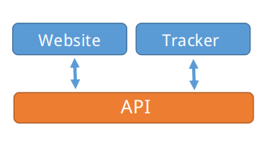
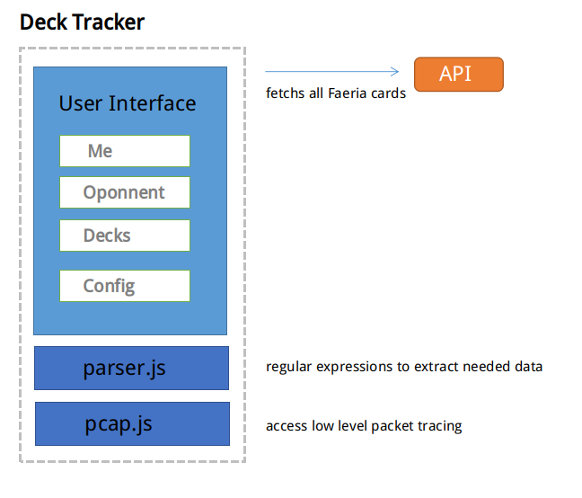

# ABOUT CARD17

**CARD17** it is Faeria fan work. It is composed by three main  projects:

- API: http://api.card17.com
- WEBSITE: http://www.card17.com
- DECK TRACKER: client app (this project)

###




## API

Backend operations, card database, user database.

- Laravel: www.laravel.com
- Mysql

## WEBSITE

Deck builder, user statistics, global statistics.

- HTML + CSS + JS
- Vue : www.vuejs.org


## DECK TRACKER

Client app, deck tracker.

- Electron-vue: https://github.com/SimulatedGREG/electron-vue
- Electron: http://electron.atom.io

# DECK TRACKER OVERVIEW

The DECK TRACKER is a client app running on user machine. It provides a user interface for showing cards revealed while playing Faeria.

By listening networking packets sent from Game to Faeria servers it is possible to know what is happening while playing.
Common events: `findMatch`, `startMatch`, `createGameCard`, `END_GAME` ...

Each of these events has attributes that are handled by tracker in order to identify current action to be executed. Like: i have bought a card, opponent played a card, victory, loss ...

- **pcap.js**: read network packets based on patterns.

- **parser.js**: get packet read from `pcap.js` and extract needed data to be handled by user interface.

- **user interface**: listen for expected events got by `pcap.js` and parsed by `parser.js`. Well, also responsible for the sexy window.


**NOTE**: this works locally and does not send any data to CARD17 servers... for now!

 

# DECK TRACKER SETUP

Well, if you have reached this point you must be an experienced developer. Setting up a development environment for modern javascript requires several steps, which I will not go into detail. But basically you will need this:

- node (8+)
- yarn
- npm

Windows, make sure to install:
- npm windows-build-tools
- Winpcap: https://www.winpcap.org/install/default.htm

Linux and OSX:
- libcap

If you have the basics installed, then you can run in DEV MODE:


``` bash
# enter project folder
cd <project-folder>

# install dependencies
yarn

# make sure to build for the first time, before running in dev mode
# not necessary build again after this time
yarn build:win
or
yarn build:linux
or
yarn build:darwin


# run in development mode
yarn dev watch

# for linux, make sure to run as root
sudo yarn dev watch

```

Building for PRODUCTION:

``` bash
# enter project folder
cd <project-folder>

# make sure to install dependencies
yarn

# build it
# Note you should build it only for you current platform

yarn build:win
or
yarn build:linux
or
yarn build:darwin

```
